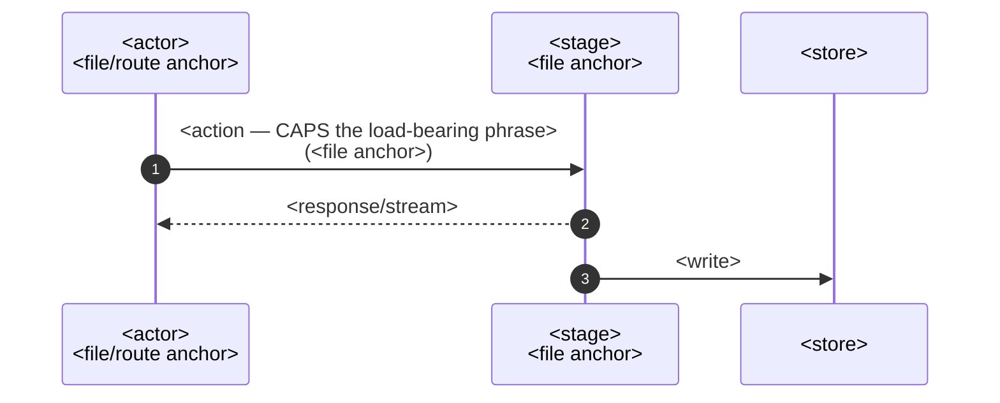

# <Capability> — <one-line qualifier>

## At a glance

- **What**: <the capability in one line — its arc, not its mechanism>.
- **Owns**:
  - <surface/mechanism this sub-domain is responsible for; gloss abbreviations at first use>;
  - <another>.
- **Does not own**:
  - <adjacent concern> — [<sibling doc>.md](<sibling-doc>.md);
  - <another> — <pointer>.
- **Ground rules**:
  - <invariant the rest of the doc depends on>;
  - <another>.
- **Why**: [`../decisions/<record>.md`](../decisions/<record>.md).

## How it works

- <clarifying bullet anchored to a step number — never re-narrating the diagram>.
- <second subtlety>.

## <Per-concern section — free-form, pedestrian name>

- <fact, present tense, citing `path/to/file.ext`>
  - <sub-detail>

| <taxonomy column> | <column> |
| --- | --- |

## Boundaries

- <what this sub-domain does NOT cover today> — tracked in <ticket/doc>.

---

_Decision record: [`../decisions/<record>.md`](../decisions/<record>.md). Source plan(s) (archived): [`<plan>.md`](../plans/archive/<plan>.md). The apex view: [`../architecture.md`](../architecture.md)._
