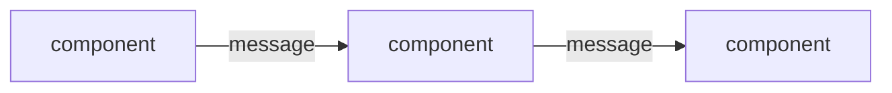

# Decision-Record Template

Copy-paste skeleton for new `decisions/` docs **when the repo has no existing decision-record convention.** If [taxonomy-catalog.md](taxonomy-catalog.md) detected ADR / MADR / RFC, use that format instead — established conventions take precedence.

Compression-ratio expectation: real-world cleanups commonly compress promoted records by 80–95% (1,000-line plans → 50–100-line records). See [worked-example.md](worked-example.md) for a synthetic walkthrough.

---

```markdown
# <short title> — implementation record

**Status:** <Landed on `main` (`<commit>`, YYYY-MM-DD); live in <env>> | <Superseded by [`other-record.md`](other-record.md)>
**Scope:** <which apps/packages this affects, in repo-relative paths>
**Current-state architecture lives in [architecture.md](../architecture.md); chronology lives in git/MR history.** This doc is the <topic>-specific record: the decisions, the load-bearing constraint, and the design.

**Acronyms.** ACR (acronym definition); ANO (another one). Define every acronym on first use.

## Motivation

<2–4 sentences. Why does this exist? What problem did it solve? What was the cheapest viable path that wasn't taken, and why this one beat it?>

## Design

<Mermaid diagram if the data flow is non-trivial. Inline, ~10–20 lines max.>



- **<Component 1>** — one sentence on what it does and the load-bearing claim about it (e.g. "no domain logic, no state").
- **<Component 2>** — same shape.
- **<Component 3>** — same shape.

## Decision record

| Decision | Choice | Why |
|---|---|---|
| <what was decided> | <the choice made> | <one-line rationale tied to a constraint or observation> |
| <what was decided> | <the choice made> | <one-line rationale> |
| <what was decided> | <the choice made> | <one-line rationale> |

One row per load-bearing choice. If a row's *Why* doesn't ground in a constraint or observed reality, drop the row — it's not load-bearing.

## The load-bearing constraint

<The external reality the design hinges on. This is the section future readers most need.>

Example shape (synthetic): "The upstream platform strips canonical metadata fields from the response payload before forwarding to its consumers — observed behavior, not documented. The wrapper envelope is therefore **the design, not a workaround**: producers inline the structured payload into a survivable text field, and downstream consumers recover it on receipt. If the upstream behavior changes, the envelope keeps working unchanged."

State it clearly, name the source of the constraint, and explain why the design's specific shape is the response to it. A reader who only reads this section should understand why the system is built the way it is.

## Known limitations & parked

- **<Limitation 1> (parked).** <One-line description and why it's parked, not broken.>
- **<Limitation 2>.** <Same shape.>
- **<Future-work item>.** <Same shape — what would be needed to lift the limitation.>

## References

- `<path>` — <one-line description of what's there>
- `<path>` — <same>
- [`<other-record>.md`](other-record.md) — <relationship to this record>

**All paths must exist in the current tree.** Verify before merging. If a path no longer exists, either fix the reference or remove the row — never leave a broken anchor.

## Open questions

1. **<Question 1>** — <context, what would resolve it>
2. **<Question 2>** — <same>

Only list questions that are *still genuinely open*. Resolved questions belong in git history, not here.
```

---

## Filling in the template — common mistakes

**Decision-record table rows that aren't actually decisions.** "We use Go" isn't a decision-record row unless going-Go was a contested choice. Rows are *load-bearing choices* — the ones that, if made differently, would change the system substantially.

**Multi-paragraph "Why" cells.** One line per row. If the rationale needs more space, it belongs in The load-bearing constraint section, not the table.

**Mermaid diagrams that show too much.** The diagram is a map, not a complete architecture. ~10–20 lines, the load-bearing flow only. Anything else dilutes.

**Status that's a sentence.** `Status:` should be one of: `Proposed`, `Landed on main (<commit>, <date>); live in <env>`, `Superseded by [<other>]`. Don't editorialize.

**References that include planning docs.** The References section is current-tree code and other decision records, not "see also the original plan." The plan was rewritten *into* this record — the plan is gone.

**Open questions that are actually known limitations.** A limitation is a *thing we know* and chose. An open question is a *thing we don't know* yet. Move "we could do X someday" from Open questions to Known limitations & parked.

## Compression discipline

If the rewrite isn't dramatically shorter than the plan it replaces, you're preserving plan-form scaffolding. Plans have:

- Phase plans / step-by-step rollout — **doesn't belong**. Git history is the rollout.
- Alternatives considered with detailed pros/cons — **belongs in the decision record table's *Why* column, one line.** The detailed comparison was useful when planning; not useful when reading.
- Open-questions-from-planning that were resolved — **doesn't belong.** Resolved questions are gone.
- Phase 0 / preflight / setup steps — **doesn't belong.** Already done.

Target the load-bearing decisions, the constraint that drives them, and the current-tree references. Cut the rest.
